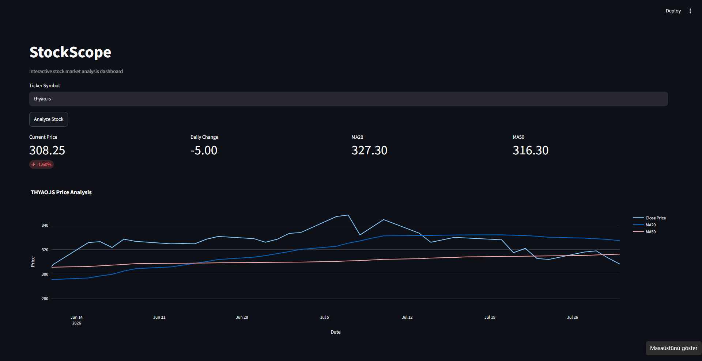

# StockScope

StockScope is a stock market dashboard built with Python.

## Screenshot

## Features

<<<<<<< HEAD
- Fetch stock data using Yahoo Finance API
- Display latest closing price
- Calculate daily price change
- Calculate daily percentage change
- Historical stock data
- Interactive Plotly charts
- Moving Average (20)
- Moving Average (50) 
- Selectable analysis period
- Responsive Streamlit dashboard
- Fetch historical stock market data
- Display the latest closing price
- Calculate daily price and percentage changes
- Visualize prices with interactive Plotly charts
- Switch between line and candlestick charts
- Display trading volume
- Calculate 20-day moving average
- Calculate 50-day moving average
- Select the analysis period
- Cache repeated market data requests
- Use a responsive Streamlit dashboard
- Display company name, sector and industry
- Show market capitalization, P/E, EPS, beta and dividend yield
- Display ticker currency in price metrics

## Technologies

- Python
- Pandas
- yfinance

## Planned Features

- RSI indicator
- MACD indicator
- Bollinger Bands
- Multiple stock comparison
- Company fundamentals
- Portfolio tracking
