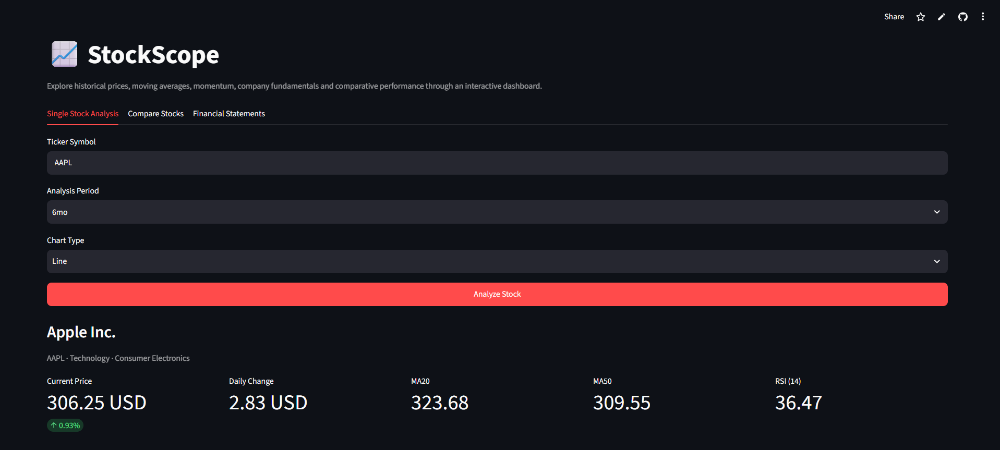
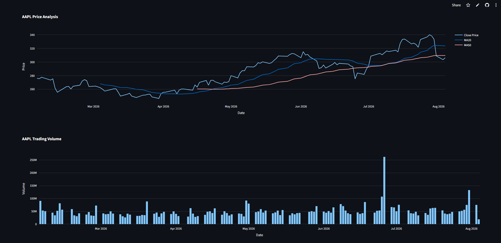

# 📈 StockScope

An interactive stock market analysis dashboard built with **Python** and **Streamlit**.

StockScope combines **technical analysis**, **company fundamentals**, **financial statement analysis**, and **multi-stock comparison** into a single modern dashboard. It is designed to help investors explore historical market data, evaluate company performance, and compare stocks through interactive visualizations.

## 🔗 Links

- 🌐 Live Demo: https://stockscope-d9mqfsctknm7n2iyiz3yha.streamlit.app/
- 💻 Source Code: https://github.com/esmaktass/stockscope
- 📧 Contact: esmanuraktas11@gmail.com

---

## 🚀 Features

### 📊 Technical Analysis

- Historical market data from Yahoo Finance
- Interactive Line Chart
- Interactive Candlestick Chart
- Trading Volume Analysis
- Moving Average (MA20)
- Moving Average (MA50)
- Relative Strength Index (RSI)
- MACD Indicator
- Bollinger Bands

### 🏢 Company Fundamentals

- Company Profile
- Sector & Industry
- Market Capitalization
- P/E Ratio
- Earnings Per Share (EPS)
- Beta
- Dividend Yield

### 📈 Financial Statements

- Income Statement
- Balance Sheet
- Cash Flow Statement
- Revenue Trend
- Net Income Trend
- Revenue Growth
- Net Income Growth
- Free Cash Flow

### 📊 Stock Comparison

- Compare up to 5 stocks
- Normalized Performance Chart
- Total Return Comparison
- Annualized Volatility
- Best Performing Stock

### 🤖 Technical Market Insights

- Rule-based market summary
- Bullish / Bearish / Neutral classification
- Technical score
- Explainable investment insights

---

## 🖼️ Dashboard Preview

### Main Dashboard



---

## 🛠️ Tech Stack

| Category | Technology |
|-----------|------------|
| Language | Python |
| UI | Streamlit |
| Data | Pandas |
| Numerical Computing | NumPy |
| Visualization | Plotly |
| Market Data | Yahoo Finance (yfinance) |

---

## 📂 Project Structure

```text
stockscope/
│
├── app.py
├── charts.py
├── comparison.py
├── data.py
├── financials.py
├── indicators.py
├── insights.py
├── requirements.txt
├── assets/
│   └── dashboard.png
├── README.md
└── .gitignore
```

---

## ⚙️ Installation

Clone the repository

```bash
git clone https://github.com/esmaktass/stockscope.git
cd stockscope
```

Create a virtual environment

```bash
python -m venv .venv
```

Activate the environment

### Windows

```bash
.venv\Scripts\activate
```

Install dependencies

```bash
pip install -r requirements.txt
```

Run the application

```bash
streamlit run app.py
```

---

## 📌 Current Capabilities

✔ Technical Indicators

✔ Company Fundamentals

✔ Financial Statement Analysis

✔ Multi-stock Comparison

✔ Technical Market Insights

✔ Interactive Charts

---

## 🚧 Future Improvements

- Portfolio Tracking
- Watchlist
- News Integration
- Analyst Recommendations
- Portfolio Optimization
- AI-powered Company Summary
- Risk Analysis
- Export Reports (PDF)

---

## 📄 License

This project is developed for educational and portfolio purposes.

---

## 👩‍💻 Author

**Esma Nur Aktaş**

Statistics Student

Data Science • Quantitative Finance • AI • Software Development